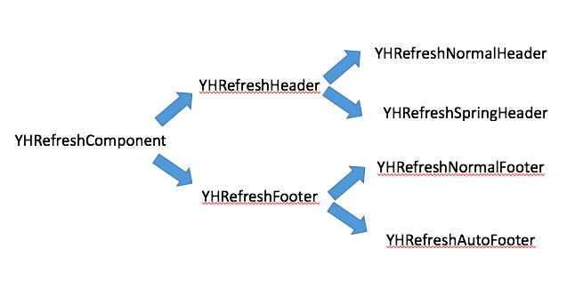

# YHRefresh

###Introduction 
Inspired By `MJRefresh`
#####A refreshing helper written in Swift, which can be used to refresh easily.
#####一款简单易用的Swift版上拉或者下拉刷新...

###Components

 
##Usage
    override func viewDidLoad() {
        super.viewDidLoad()
        
        tableView.yh_header = YHRefreshNormalHeader.header(self, selector: "load") as! YHRefreshNormalHeader
        tableView.yh_header.beginRefreshing
    }
    
    func load() {
        
        //模拟网络请求
        dispatch_after(dispatch_time(DISPATCH_TIME_NOW, (Int64)(2 * NSEC_PER_SEC)), dispatch_get_main_queue(), { () -> Void in
            
            /*网络回调处理*/
            
            self.tableView.reloadData()
            self.tableView.yh_header?.endRefreshing()
            
        }
    }

##Effect
>①YHRefreshNormalHeader

>②YHRefreshSpringHeader

>③YHRefreshNormalFooter

>④YHRefreshAutoFooter

##Requirements
* Swift 2.0

##License

Routable for iOS is available under the MIT license. See the LICENSE file for more info.

